# 🏥 Insurance Premium Prediction — Actuarial ML Pricing System

[](https://github.com/narendrakalam2001/insurance-premium-prediction-mlops/actions)
[](https://python.org)
[](https://scikit-learn.org)
[](https://fastapi.tiangolo.com)
[](https://streamlit.io)
[](https://scikit-learn.org/stable/modules/generated/sklearn.ensemble.RandomForestRegressor.html)
[](https://docker.com)
[](https://mlflow.org)
[](LICENSE)

> **Domain:** Insurance / Actuarial ML
> **Problem:** Regression — predict continuous annual insurance premium from underwriting data
> **Dataset:** [Kaggle Playground Series S4E12 — "Regression with an Insurance Dataset"](https://www.kaggle.com/competitions/playground-series-s4e12) — ~1.2M policyholders · 19 features · target `Premium Amount`
> **Industry Context:** HDFC Ergo · Bajaj Allianz · Max Bupa — actuarial ML dynamically prices health/life premiums from age, income, health score, credit score, and claims history

---

## 💡 Why This Project Matters

Insurers price millions of policies a year using actuarial models that blend demographic, financial, health, and lifestyle risk signals — not flat-rate tables. This system reproduces that pricing workflow end-to-end:

- **12 regressors** (linear, tree, boosting, neural) tuned via `RandomizedSearchCV` on the real ~1.2M-row Kaggle competition dataset, with `f_regression` feature selection (fast enough for six-figure row counts, unlike `mutual_info_regression`)
- A **rule-based Premium Engine** sits on top of the ML prediction — `HIGH_CLAIMS_LOW_HEALTH`, `LOW_CREDIT_OLD_VEHICLE`, and `SENIOR_SMOKER` hard rules can escalate a policy to manual underwriting **regardless of what the model predicts**, mirroring how real insurers layer compliance rules on top of ML pricing
- Every model promotion goes through a **3-gate Champion-Challenger** check — no model reaches production without demonstrably better RMSE, a minimum viable R², and a bounded train/test generalization gap
- A **cost-sensitive evaluation** translates prediction error into actuarial terms — under-pricing → direct underwriting loss, over-pricing → churn-risk cost — so error isn't just an abstract RMSE number

This is a genuinely **noisy, real-world dataset** (not a cleaned textbook one) — the honest results and their limitations are documented below rather than smoothed over.

---

## 🏆 Champion Model Results

Trained on the real Kaggle Playground S4E12 competition data (1,199,999 rows after cleaning).

| Metric | Score |
|---|---|
| **Champion Model** | `RandomForestRegressor` |
| **Test RMSE** | `$852.98` |
| **Test MAE** | `$654.05` |
| **Test R²** | `0.0265` |
| **Test MAPE** | `304.63%` |
| **Test RMSLE** (official competition metric) | `1.1586` |
| **Train/Test R² Gap** | `0.0201` (no overfitting) |
| **Training rows (fit / calibration / test)** | `767,999 / 192,000 / 240,000` |
| **Tuning sample** | `40,000` rows (capped — see [Performance Notes](#-performance--memory-notes)) |
| **Missing values imputed** | `1,203,748` (median/mode) |

> ⚠️ **Honest note on R²:** the real S4E12 competition data is intentionally very noisy — published top
> leaderboard solutions (heavy target-encoding + large ensembles) only reach **RMSLE ≈ 1.03–1.05**; this
> project's RMSLE=1.1586 sits in the realistic baseline range achievable without competition-grade feature
> engineering. See [Ethical & Model Considerations](#%EF%B8%8F-ethical--model-considerations) for the full picture, including results on this project's own cleaner synthetic dataset (R² ≈ 0.48–0.56).

---

## 🔗 Live Links

| Service | URL |
|---|---|
| 🚀 **FastAPI (Swagger UI)** | [https://insurance-premium-prediction-mlops.onrender.com/docs](https://insurance-premium-prediction-mlops.onrender.com/docs) |
| 📊 **Monitoring Dashboard** | [https://insurance-premium-prediction-mlops-dashboard.streamlit.app](https://insurance-premium-prediction-mlops-dashboard.streamlit.app) |
| 📓 **EDA Notebook** | [notebooks/insurance_premium_eda.ipynb](notebooks/insurance_premium_eda.ipynb) |

> ⚠️ Render free tier: first request may take 30–60 seconds (cold start).

---

## 🏗️ System Architecture

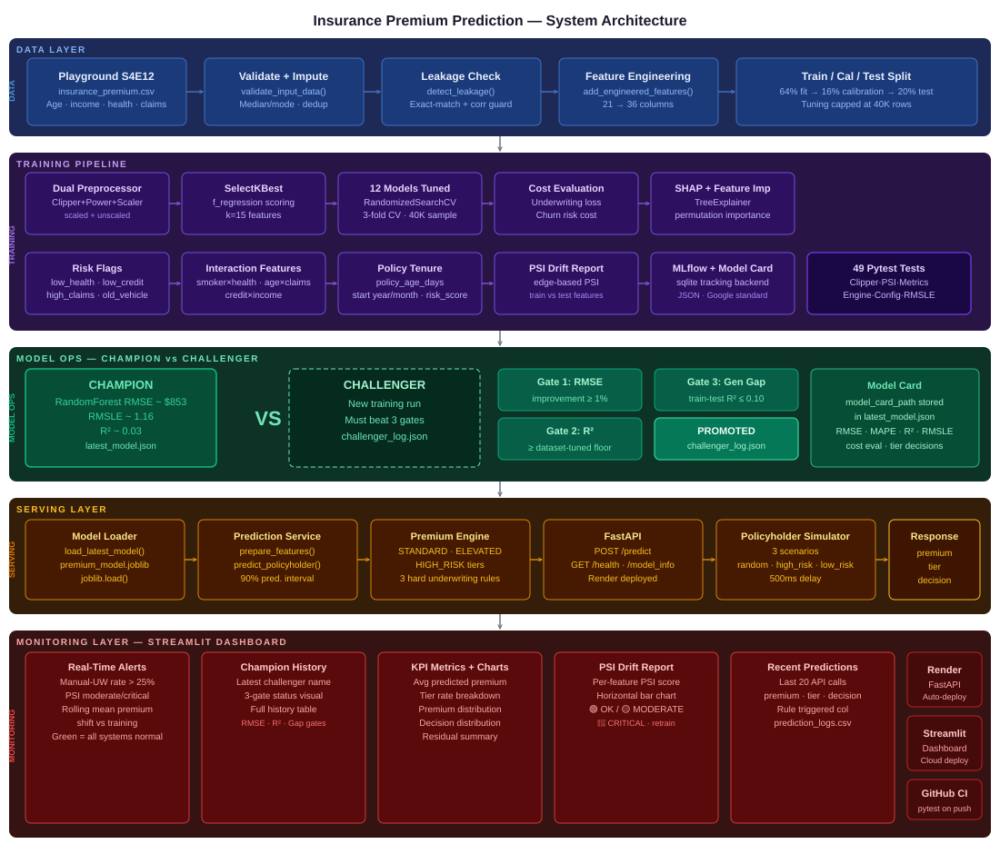

```
╔══════════════════════════════════════════════════════════════════════════════════╗
║        INSURANCE PREMIUM PREDICTION — 5-LAYER PRODUCTION SYSTEM                  ║
╠══════════════════════════════════════════════════════════════════════════════════╣
║                                                                                  ║
║  ┌─────────────────────────────── DATA LAYER ──────────────────────────────┐     ║
║  │  Kaggle S4E12 CSV → Validate+Impute → Leakage Check → Feature Eng.      │     ║
║  │  1.2M rows · 19 features · 64/16/20% fit/calibration/test split         │     ║
║  └───────────────────────────────────┬─────────────────────────────────────┘     ║
║                                      ▼                                           ║
║  ┌─────────────────────────── TRAINING PIPELINE ───────────────────────────┐     ║
║  │                                                                         │     ║
║  │  ┌──────────────────┐    ┌───────────────┐    ┌──────────────────────┐  │     ║
║  │  │  Dual Preproc.   │    │  12 Models    │    │  Evaluation          │  │     ║
║  │  │  Clipper+Power   │───▶│  Linear/Tree  │───▶│  RMSE·MAE·R²·RMSLE  │  │     ║
║  │  │  +Scale/Ordinal  │    │  Boosting/MLP │    │  SHAP · Cost eval    │  │     ║
║  │  └──────────────────┘    └───────────────┘    └──────────────────────┘  │     ║
║  │                                                                         │     ║
║  │  SelectKBest(f_regression, k=15) · RandomizedSearchCV 3-fold            │     ║
║  │  Tuning capped at 40K-row subsample · N_JOBS=4 (OOM-safe)               │     ║
║  │                                                                         │     ║
║  │  CHAMPION → RandomForest  RMSE=$852.98  RMSLE=1.1586  R²=0.0265         │     ║
║  └───────────────────────────────────┬─────────────────────────────────────┘     ║
║                                      ▼                                           ║
║  ┌──────────────────────── CHAMPION-CHALLENGER ────────────────────────────┐     ║
║  │                                                                         │     ║
║  │  Gate 1: RMSE improvement       ≥ 1%      →  ✅ PASS / ❌ FAIL         │     ║
║  │  Gate 2: challenger R²          ≥ dataset-tuned floor →  ✅ / ❌       │     ║
║  │  Gate 3: train-test R² gap      ≤ 0.10    →  ✅ PASS / ❌ FAIL         │     ║
║  │                                                                         │     ║
║  │  ALL gates pass → PROMOTED (latest_model.json updated)                  │     ║
║  │  ANY gate fails → REJECTED (champion retained, result logged)           │     ║
║  └───────────────────────────────────┬─────────────────────────────────────┘     ║
║                                      ▼                                           ║
║  ┌──────────────────────────── SERVING LAYER ──────────────────────────────┐     ║
║  │                                                                         │     ║
║  │  Model Loader → Prediction Service → Premium Engine → FastAPI           │     ║
║  │                                                                         │     ║
║  │  POST /predict     → policyholder JSON → premium + tier + decision      │     ║
║  │  GET  /health       → API health check                                  │     ║
║  │  GET  /model_info   → champion model registry (metrics + card path)     │     ║
║  │                                                                         │     ║
║  │  Premium Engine:  P(premium) → tier → decision                          │     ║
║  │    → STANDARD/ELEVATED/HIGH_RISK  +  3 hard underwriting rules          │     ║
║  └───────────────────────────────────┬─────────────────────────────────────┘     ║
║                                      ▼                                           ║
║  ┌─────────────────── MONITORING LAYER — STREAMLIT DASHBOARD ──────────────┐     ║
║  │                                                                         │     ║
║  │  Section 1: Real-Time Alerts    → manual-UW rate · PSI drift            │     ║
║  │  Section 2: Champion-Challenger → decision · 3-gate status · history    │     ║
║  │  Section 3: KPIs + Charts       → tier breakdown · premium distribution │     ║
║  │  Section 4: PSI Drift           → per-feature PSI · train vs test       │     ║
║  │  Section 5: Recent Predictions  → audit log · rule triggered            │     ║
║  │  Sidebar:   Live Quote          → fill form → instant premium quote     │     ║
║  │                                                                         │     ║
║  │  Simulator: 3 scenarios (random · high_risk · low_risk) → hits /predict │     ║
║  └─────────────────────────────────────────────────────────────────────────┘     ║
╚══════════════════════════════════════════════════════════════════════════════════╝
```

---

## 📸 Dashboard Screenshots

### 🖥️ Full Dashboard UI

Real-time premium quoting dashboard — live sidebar quote form · Champion-Challenger system · KPI cards · PSI drift · prediction audit log.

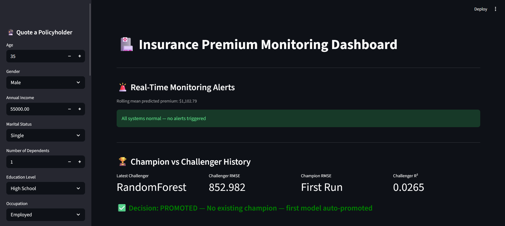

---

### 📊 Model KPIs & Performance Charts

Avg predicted premium · STANDARD/ELEVATED/HIGH_RISK tier rates · predicted-premium distribution with tier boundary lines.

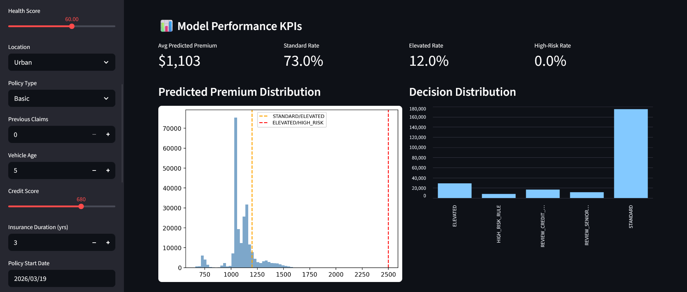

---

### 🎯 Premium Tier Breakdown

Distribution of policyholders across STANDARD, ELEVATED, and HIGH_RISK premium tiers, plus decision categories (AUTO_QUOTE / AUTO_QUOTE_WITH_LOADING / MANUAL_UNDERWRITING).

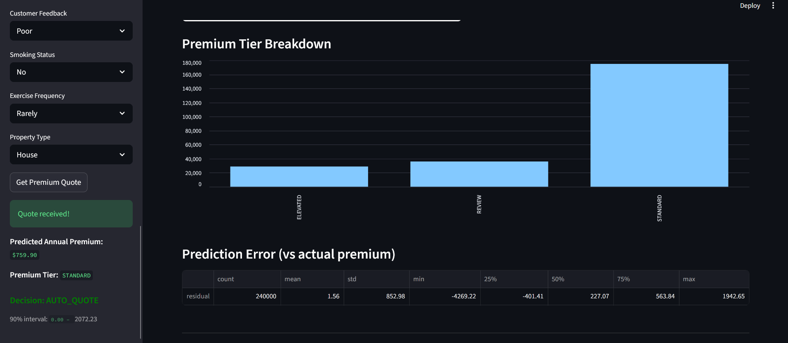

---

### 📈 Feature Drift Report (PSI)

Per-feature Population Stability Index, train vs test — colour-coded: 🟢 OK · 🟡 moderate · 🔴 critical (retrain trigger).

.png)

---

### 📉 Feature PSI Drift Scores — Bar Chart

Top-10 features ranked by PSI drift score with moderate (0.10) and critical (0.20) reference lines.

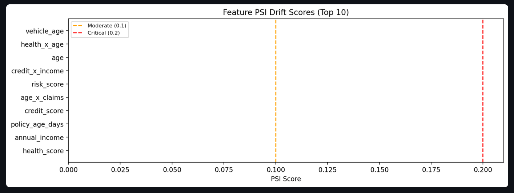

---

### 📋 Recent Predictions Log

Live API prediction audit log — age · health score · previous claims · smoking status · predicted premium · tier · decision · rule triggered.

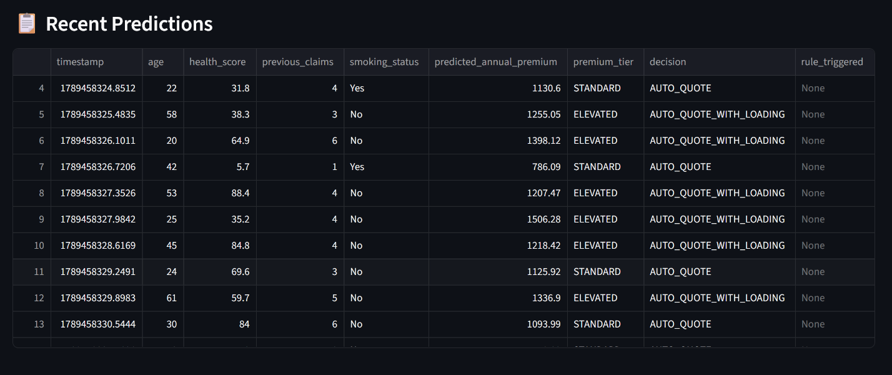

---

## 📊 Training Reports

| Predicted vs Actual | Residual Analysis |
|---|---|
| 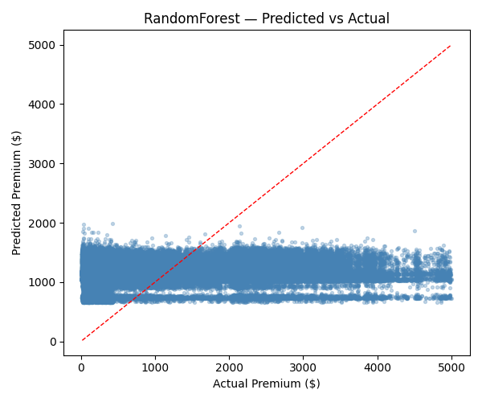 | 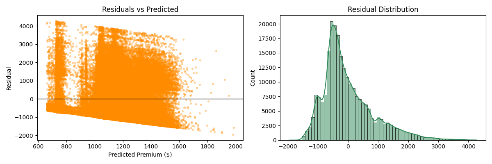 |

| Champion-Challenger | Simulation Run |
|---|---|
| 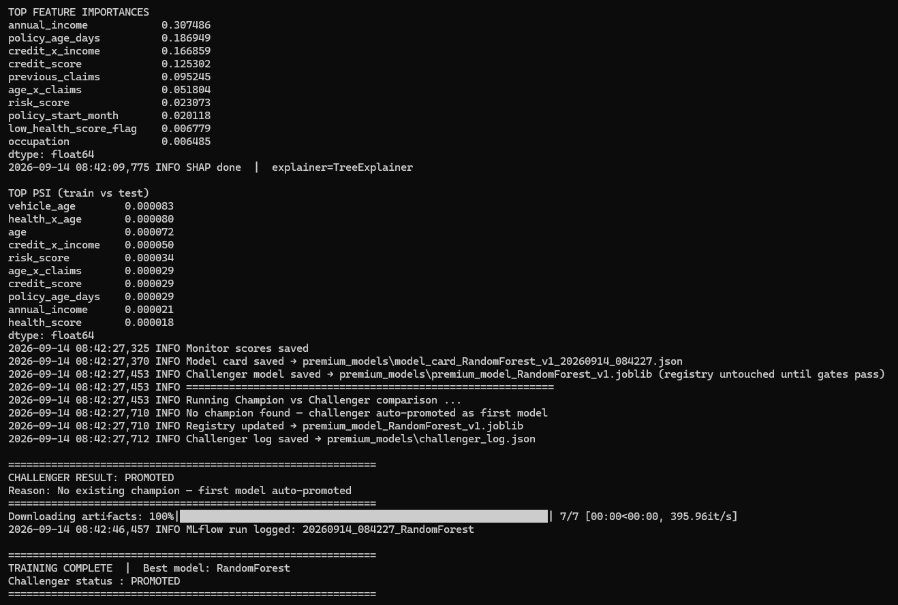 | 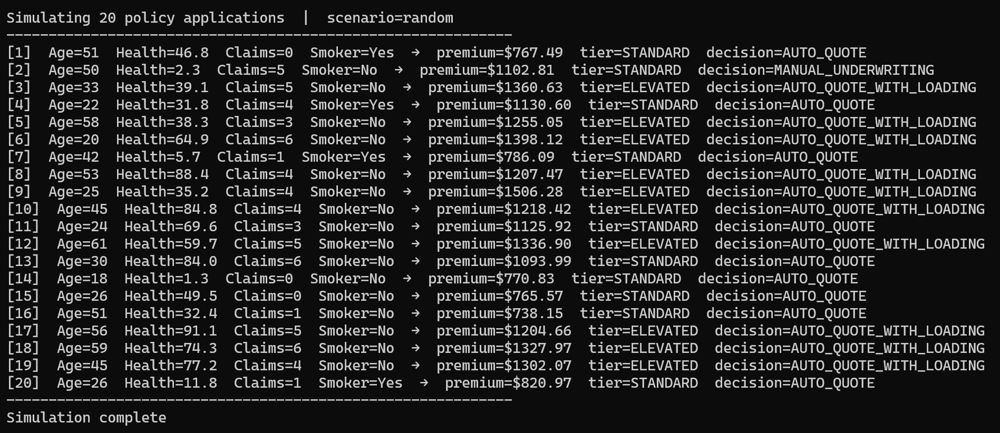 |

| Test Coverage | Training & Evaluation Summary |
|---|---|
| 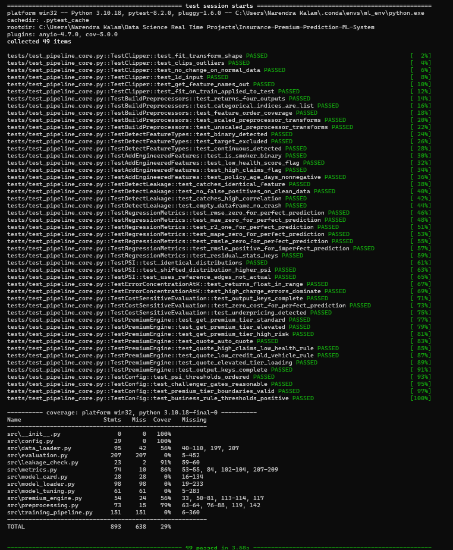 | 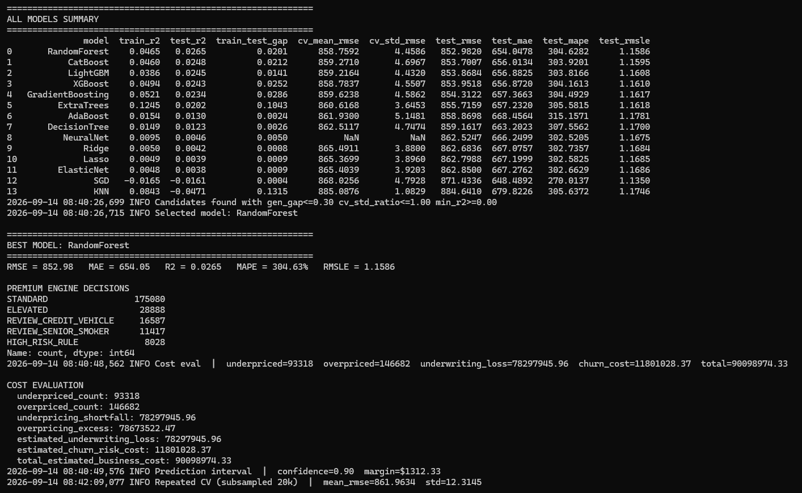 |

---

## 🎬 System Demo

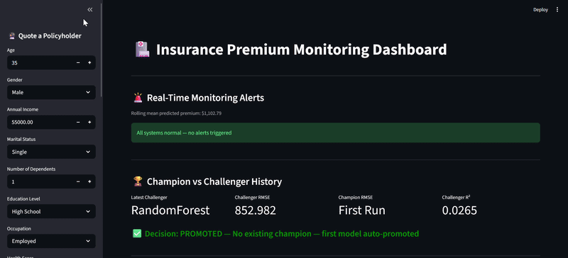

---

## 📁 Project Structure

```
Insurance-Premium-Prediction-ML-System/
│
├── src/                                    # Core ML system
│   ├── config.py                           # All constants — tiers, thresholds, challenger gates
│   ├── data_loader.py                      # Validation · imputation · actuarial feature engineering
│   ├── preprocessing.py                    # Clipper · dual ColumnTransformer (scaled/unscaled)
│   ├── leakage_check.py                    # Exact-match + correlation leakage guard
│   ├── metrics.py                          # RMSE·MAE·R²·MAPE·RMSLE · PSI · cost-sensitive eval
│   ├── model_tuning.py                     # 12-model grid · RandomizedSearchCV (f_regression)
│   ├── evaluation.py                       # Model selection · SHAP · feature importance · MLflow
│   ├── premium_engine.py                   # Rule-based + ML-tiered pricing decisions
│   ├── model_card.py                       # Google Model Cards-style JSON
│   ├── model_loader.py                     # Champion-Challenger 3-gate system
│   └── training_pipeline.py               # End-to-end training pipeline
│
├── serving/
│   └── insurance_premium_api.py           # FastAPI: /predict · /health · /model_info
│
├── services/
│   └── prediction_service.py              # Feature prep → model.predict → premium engine
│
├── monitoring/
│   └── monitoring_dashboard.py            # Streamlit: 5-section monitoring dashboard
│
├── simulation/
│   └── policyholder_simulator.py          # 3-scenario synthetic traffic generator
│
├── tests/
│   └── test_pipeline_core.py              # 49 pytest unit tests — all passing
│
├── scripts/
│   ├── train_model.py                      # python scripts/train_model.py
│   ├── run_api.py                          # python scripts/run_api.py
│   ├── run_dashboard.py                    # python scripts/run_dashboard.py
│   └── run_simulation.py                  # python scripts/run_simulation.py
│
├── notebooks/
│   ├── insurance_premium_eda.ipynb        # Professional EDA — 24 steps
│   └── insurance_premium_eda.html         # Rendered HTML export
│
├── data/
│   ├── sample_insurance_premium_dataset.csv  # Representative sample for quick testing
│   └── sample_dataset_info.txt               # Dataset schema + column notes
│
├── premium_models/                        # Model artifacts — JSON + joblib
│   ├── latest_model.json                  # Champion model registry
│   ├── challenger_log.json                # Full Champion-Challenger comparison history
│   ├── model_card_*.json                  # Google Model Card JSON
│   ├── model_experiment_results.csv       # Full 12-model leaderboard
│   ├── monitor_scores.csv                 # Test-set predictions for dashboard KPIs
│   └── feature_drift_report.csv           # PSI drift per feature
│
├── docs/
│   ├── architecture/
│   │   └── insurance_premium_architecture.svg   # 5-layer system architecture diagram
│   ├── plots/
│   │   ├── predicted_vs_actual.png              # Predicted vs actual premium scatter
│   │   └── residual_analysis.png                # Residuals vs predicted + distribution
│   ├── screenshots/
│   │   ├── dashboard_full_ui.png                # Full Streamlit dashboard UI
│   │   ├── model_performance_kpis.png           # KPI cards + premium distribution
│   │   ├── premium_tier_breakdown.png           # Tier + decision distribution
│   │   ├── feature_drift_report(psi).png        # PSI drift table
│   │   ├── feature_psi_drift_scores.png         # PSI drift bar chart
│   │   └── recent_predictions.png               # Recent predictions audit log
│   ├── reports/
│   │   ├── challenger_evaluation.png            # Champion-Challenger gate results
│   │   ├── simulation.png                       # Simulation run terminal output
│   │   ├── test_coverage.png                    # pytest 49/49 coverage report
│   │   └── training_model_summary.png           # Training summary
│   └── gifs/
│       └── system_demo.gif                      # End-to-end system demo
│
├── logs/
│   └── prediction_logs.csv               # API prediction audit log (auto-generated)
│
├── mlruns/                               # MLflow tracking store (sqlite backend)
├── _generate_data.py                     # Schema-matched synthetic dataset generator
├── Dockerfile                            # FastAPI production image
├── Dockerfile.dashboard                  # Streamlit dashboard container
├── docker-compose.yml                    # API + Dashboard (ports 8000 + 8501)
├── .github/workflows/ci.yml             # GitHub Actions — pytest on every push
├── .gitignore
├── .dockerignore
├── LICENSE                               # MIT License
├── README.md                             # This file
├── render.yaml                           # Render.com deployment config
├── requirements.txt                      # All dependencies
├── requirements_api.txt                  # API-only deployment deps
├── requirements_dashboard.txt            # Dashboard-only deployment deps
└── runtime.txt                           # Python 3.10.13
```

---

## 🚀 Quickstart

### 1. Clone & Install

```bash
git clone https://github.com/narendrakalam2001/insurance-premium-prediction-mlops.git
cd insurance-premium-prediction-mlops
pip install -r requirements.txt
```

### 2. Get the Dataset

Download [Kaggle Playground Series S4E12](https://www.kaggle.com/competitions/playground-series-s4e12/data) → `train.csv`, then either:

```powershell
$env:INSURANCE_DATA_PATH = "path\to\train.csv"
```

...or skip this and the pipeline falls back to the bundled schema-matched sample dataset in `data/`.

### 3. Train Model

```bash
python scripts/train_model.py
```

Expected output:
```
INFO  Data validation passed  | shape=(1199999, 20)  mean_premium=1102.55
INFO  Split | train_fit=767999 cal=192000 test=240000
INFO  Tuning sample capped: 767999 -> 40000 rows
INFO  Selected model: RandomForest
INFO  BEST MODEL: RandomForest
INFO  RMSE = 852.98  MAE = 654.05  R2 = 0.0265  MAPE = 304.63%  RMSLE = 1.1586
INFO  CHALLENGER RESULT: PROMOTED
INFO  TRAINING COMPLETE
```

### 4. Start API

```bash
python scripts/run_api.py
# API:  http://localhost:8000
# Docs: http://localhost:8000/docs
```

### 5. Start Dashboard

```bash
python scripts/run_dashboard.py
# Dashboard: http://localhost:8501
```

### 6. Run Simulation

```bash
python scripts/run_simulation.py
```

### 7. Run Tests

```bash
pytest tests/ -v --cov=src --cov-report=term-missing
# 49 collected · 49 passed
```

---

## 🐳 Docker

```bash
# Start everything
docker compose up --build

# API only
docker compose up api

# Dashboard only
docker compose up dashboard

# Stop
docker compose down
```

| Service | URL |
|---|---|
| FastAPI + Swagger | `http://localhost:8000/docs` |
| Streamlit Dashboard | `http://localhost:8501` |

---

## 🌐 API Reference

### POST /predict — Single Policyholder Quote

```bash
curl -X POST "http://localhost:8000/predict" \
  -H "Content-Type: application/json" \
  -d '{
        "age": 45, "gender": "Male", "annual_income": 45000,
        "marital_status": "Married", "number_of_dependents": 2,
        "education_level": "Bachelor'"'"'s", "occupation": "Employed",
        "health_score": 25.0, "location": "Urban", "policy_type": "Premium",
        "previous_claims": 4, "vehicle_age": 17, "credit_score": 460,
        "insurance_duration": 5, "policy_start_date": "2022-01-15",
        "customer_feedback": "Poor", "smoking_status": "Yes",
        "exercise_frequency": "Rarely", "property_type": "House"
      }'
```

**Response:**
```json
{
  "predicted_annual_premium": 4098.63,
  "premium_tier": "HIGH_RISK",
  "decision": "MANUAL_UNDERWRITING",
  "rule_triggered": "HIGH_CLAIMS_LOW_HEALTH",
  "prediction_interval_90pct": {
    "low": 3338.59,
    "high": 4858.67
  },
  "latency_seconds": 0.0288
}
```

### GET /health

```json
{"status": "running", "model_loaded": true}
```

### GET /model_info

Returns the champion model registry — model filename, prediction margin, model card path.

---

## 📊 All 12 Models — Full Leaderboard

Ranked by test RMSE on the real S4E12 test set (n=240,000):

| Model | Test R² | Test RMSE | Test MAE | Test RMSLE |
|---|---|---|---|---|
| **RandomForest** ⭐ | 0.0265 | **$852.98** | $654.05 | 1.1586 |
| CatBoost | 0.0248 | $853.70 | $656.01 | 1.1595 |
| LightGBM | 0.0245 | $853.87 | $656.88 | 1.1608 |
| XGBoost | 0.0243 | $853.95 | $656.87 | 1.1610 |
| GradientBoosting | 0.0234 | $854.31 | $657.37 | 1.1617 |
| ExtraTrees | 0.0202 | $855.72 | $657.23 | 1.1618 |
| AdaBoost | 0.0130 | $858.87 | $668.46 | 1.1781 |
| DecisionTree | 0.0123 | $859.16 | $663.20 | 1.1700 |
| NeuralNet (MLP) | 0.0046 | $862.52 | $666.25 | 1.1675 |
| Ridge | 0.0042 | $862.68 | $667.08 | 1.1684 |
| Lasso | 0.0039 | $862.80 | $667.20 | 1.1685 |
| ElasticNet | 0.0038 | $862.85 | $667.28 | 1.1686 |
| SGD | -0.0161 | $871.43 | $648.49 | 1.1350 |
| KNN | -0.0471 | $884.64 | $679.82 | 1.1746 |

> Full leaderboard: [`premium_models/model_experiment_results.csv`](premium_models/model_experiment_results.csv)

---

## 🏆 Champion vs Challenger — 3-Gate Promotion

Every new training run is compared against the production champion using **3 promotion gates**:

| Gate | Condition | Rationale |
|---|---|---|
| RMSE Improvement | Challenger must beat champion by ≥ 1% relative | Meaningful accuracy gain only |
| R² Threshold | ≥ dataset-tuned floor (`config.py::MIN_R2_THRESHOLD`) | Minimum viable predictive power for the dataset in use |
| Train-Test R² Gap | ≤ 0.10 | No overfitting to the training set |

> **Why is the R² floor "dataset-tuned" instead of a fixed number?** The real S4E12 competition data
> supports R² ≈ 0.02–0.06 at best without heavy competition-grade feature engineering, while this
> project's own cleaner synthetic dataset supports R² ≈ 0.48–0.56. A single hard-coded threshold would
> make the gate either impossible to pass (real data) or meaningless (synthetic data) — so `MIN_R2_THRESHOLD`
> is set relative to whichever dataset is currently being trained on.

**Real run — first model auto-promotion:**

```
CHAMPION vs CHALLENGER
  Champion  : (none — first run)
  Challenger: RandomForest  RMSE=852.9820  R2=0.0265
No champion found — challenger auto-promoted as first model
CHALLENGER RESULT: PROMOTED
TRAINING COMPLETE
  Best model: RandomForest
```

> Every fresh registry starts with zero-friction auto-promotion — subsequent retrains must then clear
> all 3 gates to replace this champion. Results logged to `premium_models/challenger_log.json` and
> visible in the dashboard Section 2 with per-gate ✅/❌ status.

---

## 🎯 Premium Engine — 3-Tier Decisioning + Business Rules

Predicted premium is never returned "raw" — it passes through `src/premium_engine.py`, which layers
hard actuarial business rules on top of the ML prediction:

| Tier / Rule | Trigger | Decision |
|---|---|---|
| `STANDARD` | predicted premium < $1,200 | `AUTO_QUOTE` |
| `ELEVATED` | $1,200 ≤ premium < $2,500 | `AUTO_QUOTE_WITH_LOADING` |
| `HIGH_RISK` | predicted premium ≥ $2,500 | `MANUAL_UNDERWRITING` |
| `HIGH_CLAIMS_LOW_HEALTH` | previous claims ≥ 3 **and** health score < 30 | `MANUAL_UNDERWRITING` (hard rule, overrides ML) |
| `LOW_CREDIT_OLD_VEHICLE` | credit score < 500 **and** vehicle age ≥ 15 | `MANUAL_UNDERWRITING` |
| `SENIOR_SMOKER` | age ≥ 60 **and** smoker | `MANUAL_UNDERWRITING` |

Business rules are evaluated **after** the ML prediction — matching how real insurers layer compliance/underwriting rules on top of a pricing model rather than baking them into the model itself.

**Real run — full test set (n=240,000) decision breakdown:**

| Decision | Count |
|---|---|
| STANDARD | 175,080 |
| ELEVATED | 28,888 |
| REVIEW_CREDIT_VEHICLE | 16,587 |
| REVIEW_SENIOR_SMOKER | 11,417 |
| HIGH_RISK_RULE | 8,028 |

Every `/predict` response also returns a **90% residual-quantile prediction interval** (regression analogue of probability calibration) computed on a held-out calibration split.

---

## 💰 Business Impact — Cost-Sensitive Evaluation

`src/metrics.py::cost_sensitive_evaluation` frames prediction error in actuarial terms on the real test set (n=240,000):

| Metric | Value |
|---|---|
| Under-priced policies | 93,318 / 240,000 |
| Over-priced policies | 146,682 / 240,000 |
| Estimated underwriting loss | **$78,297,945.96** |
| Estimated churn-risk cost | **$11,801,028.37** |
| **Total estimated business cost** | **$90,098,974.33** |

> This framing lets underwriting teams see that under-pricing (insurer absorbs the claim gap) is the
> dominant risk here — ~7× larger than over-pricing/churn-risk cost — which is exactly the kind of
> asymmetric-loss insight a plain RMSE leaderboard hides.

---

## 🔬 Top Feature Importances (Champion Model)

| Feature | Importance |
|---|---|
| **annual_income** | 0.3075 |
| **policy_age_days** | 0.1869 |
| **credit_x_income** (engineered interaction) | 0.1669 |
| **credit_score** | 0.1253 |
| **previous_claims** | 0.0952 |
| **age_x_claims** (engineered interaction) | 0.0518 |
| **risk_score** (composite) | 0.0231 |
| **policy_start_month** | 0.0201 |
| **low_health_score_flag** | 0.0068 |
| **occupation** | 0.0065 |

> `credit_x_income` and `age_x_claims` — engineered interaction features — rank in the top 6, validating
> the feature-engineering strategy in `data_loader.py::add_engineered_features()`: raw columns alone
> under-explain premium, and the real signal lives partly in the interactions.

---

## 📈 Monitoring Dashboard — 5 Sections

| Section | What it shows |
|---|---|
| **1. Real-Time Alerts** | Manual-underwriting rate > 25% · PSI moderate/critical drift |
| **2. Champion-Challenger** | Latest decision badge · 3-gate pass/fail status · full history table |
| **3. KPIs + Charts** | Avg premium · tier rates · premium distribution · decision distribution |
| **4. PSI Drift** | Per-feature PSI, train vs test · colour-coded bar chart |
| **5. Recent Predictions** | Last 20 API calls · premium · tier · decision · rule triggered |
| **Sidebar** | Live quote — fill policyholder form → instant premium + tier + decision |

---

## 🧪 Test Coverage

```
49 tests collected across 11 test classes:

  TestClipper                (6)  — fit/transform shape · outlier clipping · 1D input ·
                                     get_feature_names_out · fit-on-train applied to test
  TestBuildPreprocessors      (5)  — 4 outputs · categorical indices · feature order coverage ·
                                     scaled/unscaled transform no-NaN
  TestDetectFeatureTypes      (3)  — binary detection · target excluded · continuous detection
  TestAddEngineeredFeatures   (4)  — is_smoker binary · low_health_score_flag · high_claims_flag ·
                                     policy_age_days non-negative
  TestDetectLeakage           (4)  — identical feature caught · no false positives · high corr caught ·
                                     empty dataframe no crash
  TestRegressionMetrics       (7)  — RMSE/MAE/R²/MAPE/RMSLE zero-for-perfect · RMSLE positive ·
                                     residual stats keys
  TestPSI                     (3)  — identical distributions · shifted distribution higher PSI ·
                                     reference-edge binning
  TestErrorConcentrationAtK   (2)  — range check · high-charge error dominance
  TestCostSensitiveEvaluation (3)  — output keys complete · zero cost for perfect prediction ·
                                     underpricing detected
  TestPremiumEngine           (8)  — tier boundaries · auto-quote · both hard rules · elevated loading ·
                                     output keys complete
  TestConfig                  (4)  — PSI threshold ordering · challenger gate sanity ·
                                     tier boundaries valid · business rule thresholds positive

Result: 49 passed · 0 failed
```


---

## 🧠 Technical Standards

| Component | Implementation |
|---|---|
| **Models** | 12 regressors — Ridge, Lasso, ElasticNet, SGD, KNN (scaled) · DecisionTree, RandomForest, ExtraTrees, GradientBoosting, AdaBoost, XGBoost, LightGBM (unscaled) · MLPRegressor (separate) |
| **Feature Selection** | `SelectKBest(f_regression, k=15)` — vectorized ANOVA F-test, not `mutual_info_regression` (too slow at 100K+ rows) |
| **Outlier Handling** | Custom `Clipper` transformer — IQR-based, fit on train only |
| **Preprocessing** | Dual ColumnTransformer — scaled branch (Power+Standard) for linear/distance models, unscaled (Clip-only) for tree models |
| **Hyperparameter Search** | `RandomizedSearchCV` — 3-fold CV, 10 candidates/model, capped 40K-row tuning subsample |
| **Explainability** | SHAP `TreeExplainer` + permutation importance fallback |
| **Calibration** | 90% residual-quantile prediction interval (regression analogue of probability calibration) |
| **Model Card** | Google Model Cards standard — JSON with metrics, cost eval, decision counts |
| **Experiment Tracking** | MLflow — sqlite backend, params/metrics/model artifact per run |
| **Champion-Challenger** | 3-gate: RMSE improvement ≥ 1% · R² ≥ dataset-tuned floor · gap ≤ 0.10 |
| **Leakage Detection** | Exact-match + high-correlation guard, run pre-training |
| **Drift Monitoring** | PSI (edge-based, reference-quantile binning) — train vs test, per feature |
| **CI/CD** | GitHub Actions — pytest on every push |
| **Deployment** | Render.com (FastAPI) + Streamlit Cloud (Dashboard) |
| **Memory Safety** | `N_JOBS=4` (not `-1`) + 40K-row tuning cap — prevents OOM on large real-world datasets |

---

## ⚙️ Performance / Memory Notes

This dataset (~1.2M rows) is roughly **900× larger** than a typical textbook insurance dataset, which surfaced real engineering constraints during development:

- `SelectKBest` uses `f_regression` (vectorized), not `mutual_info_regression` — the latter is
  roughly O(n²) per feature and made a single model's hyperparameter search hang indefinitely at
  100K+ rows.
- `N_JOBS=4` (not `-1`) in `config.py` — unbounded parallel tree-ensemble fits triggered a silent
  OOM kill on RandomForest during development.
- `MAX_TUNING_SAMPLE_SIZE=40_000` — `RandomizedSearchCV` tunes on a capped, reproducible random
  subsample of the training split; final scoring always uses the full, untouched test set.
- NeuralNet's `cross_val_score` step is skipped in `evaluate_models()` — refitting MLP 3 extra times
  inside the CV loop, on top of the tuning fits already done, was a further OOM contributor. MLP
  already carries an internal `early_stopping` validation split.

---

## ⚖️ Ethical & Model Considerations

- **R² is genuinely low (0.0265) on the real dataset** — this is a property of the Kaggle Playground
  S4E12 data (intentionally noisy by design), not a pipeline defect. Top competition leaderboard
  solutions with heavy target-encoding and large ensembles only reach RMSLE ≈ 1.03–1.05 vs this
  project's 1.1586 baseline-tier result.
- **Prediction intervals are wide** (e.g. $0–$2,072 around a $760 point estimate in dashboard testing) —
  this honestly reflects the champion model's real uncertainty rather than presenting an overconfident
  narrow interval. Business stakeholders should read the point estimate with this uncertainty in mind.
- **This project also maintains a cleaner, schema-identical synthetic dataset** (`_generate_data.py`,
  `data/sample_insurance_premium_dataset.csv`) with a stronger, more deterministic premium formula
  (R² ≈ 0.48–0.56) — useful for demonstrating pipeline mechanics without the real dataset's inherent noise
  ceiling, but should not be confused with real-world predictive performance.
- Age, gender, and health score are used as direct pricing features — in production, actuarial pricing
  using protected attributes is subject to jurisdiction-specific insurance regulation (e.g. IRDAI
  guidelines in India, state insurance codes in the US); this project is a technical ML demonstration,
  not a compliance-reviewed pricing system.
- `MIN_R2_THRESHOLD` in `config.py` is dataset-relative by design (see the Champion-Challenger section)
  — retraining on a different dataset without re-checking this value could let a genuinely worse model
  get promoted.
- Missing values (~1.2M cells, median/mode imputed) are not verified missing-at-random — imputation
  bias is possible and not separately audited here.

---

## 👨‍💻 About

**Narendra Kalam** — MSc Computer Science (Gold Medalist — NASSCOM, Full Stack Data Science + AI)

> Building 20+ industry-level, end-to-end ML systems across all domains.

[](https://www.linkedin.com/in/narendra-kalam/)
[](https://www.kaggle.com/narendrakalam)
[](https://narendrakalam2001.github.io/)
[](mailto:kalamnarendra2001@gmail.com)

### Portfolio Projects

| # | Project | Domain | Champion Model | Key Metric |
|---|---|---|---|---|
| 1 | Credit Card Fraud Detection | BFSI / Fintech | ExtraTrees | F1 = 0.8962 · 284K transactions |
| 2 | Credit Risk Prediction | BFSI / Lending | LightGBM | F1 = 0.9741 · ROC-AUC = 0.9991 |
| 3 | Customer Churn Prediction | Telecom / BFSI | CatBoost | F1 = 0.634 · Recall = 0.7312 |
| 4 | House Price Prediction | Real Estate | CatBoost | RMSE = $20,128 · R² = 0.9053 |
| 5 | Store Sales Forecasting | Retail / Supply Chain | LightGBM (Ensemble) | RMSLE = 0.3739 · R² = 0.9761 |
| 6 | Energy Demand Forecasting | Energy / Utilities | ElasticNet | RMSE = 712.04 MW · R² = 0.9759 |
| 7 | Stock Price & Risk Forecasting | Fintech / Capital Markets | Ridge | DirAcc = 53.44% · Sharpe = 0.80 |
| 8 | Resume Screener AI | HR Tech | LightGBM | F1 = 0.7608 · Top-3 = 0.9416 |
| 9 | ABSA Sentiment Analysis | E-Commerce / Banking | RidgeClassifier | Macro-F1 = 0.6212 · ROC-AUC = 0.823 |
| 10 | Fake News Detector | Media Tech / Gov Tech | XGBoost | F1 = 0.9993 · ROC = 1.0000 |
| 11 | BC5CDR Clinical NER | Biomedical NLP | BioBERT | F1 = 0.8847 · Chemical F1 = 0.9239 |
| 12 | News Topic Modeling | Media Analytics | LDA (Gensim) | Cv = 0.6225 · Diversity = 0.92 |
| 13 | Chest X-Ray Diagnosis | Healthcare AI | DenseNet121 | Mean AUC = 0.7864 · 14 classes |
| 14 | Real-Time Object Detection | Computer Vision / Retail-Security | YOLOv8s | mAP50-95 = 0.5341 · 32 FPS |
| 15 | Face Emotion Recognition | EdTech / Retail CX | CNN-from-scratch | Macro-F1 = 0.5950 · 7 classes |
| 16 | Customer Segmentation Engine | E-Commerce / BFSI | DBSCAN (Unsupervised) | Silhouette = 0.4056 |
| 17 | Market Basket Analysis (Instacart) | Retail / Quick-Commerce | Apriori | 68,820 rules · mean lift = 15.66 |
| 18 | E-Commerce / OTT Recommender | E-Commerce / Streaming | Hybrid (SVD + Content) | NDCG@10 = 0.0407 · 4 candidates |
| 19 | Hospital Readmission Prediction | Healthcare / Hospital Ops | ExtraTrees | F1 = 0.2702 · ROC-AUC = 0.6513 |
| 20 | HR Policy Intelligence Chatbot | HR Tech / Enterprise GenAI | Gemini 3.6 Flash + RAG | 30/30 tests · guardrail threshold=0.35 |
| 21 | Employee Attrition Prediction | HR Tech / People Analytics | NeuralNet (MLP) | F1 = 0.3902 · ROC-AUC = 0.6698 |
| 22 | ANN From Scratch — MNIST Digit Recognizer | Deep Learning Fundamentals | From-scratch ANN | Test Acc = 0.9740 · Macro F1 = 0.9739 |
| 23 | **Insurance Premium Prediction** | **Insurance / Actuarial ML** | **RandomForest** | **RMSLE = 1.1586 · 1.2M real policies** |

---

## 📚 References

- Kaggle Playground Series S4E12 — [Regression with an Insurance Dataset](https://www.kaggle.com/competitions/playground-series-s4e12)
- Population Stability Index (PSI) — standard credit-risk/actuarial drift-monitoring metric
- Google Model Cards — [Model Cards for Model Reporting (Mitchell et al., 2019)](https://arxiv.org/abs/1810.03993)

---

## 📄 License

MIT License — see [LICENSE](LICENSE)